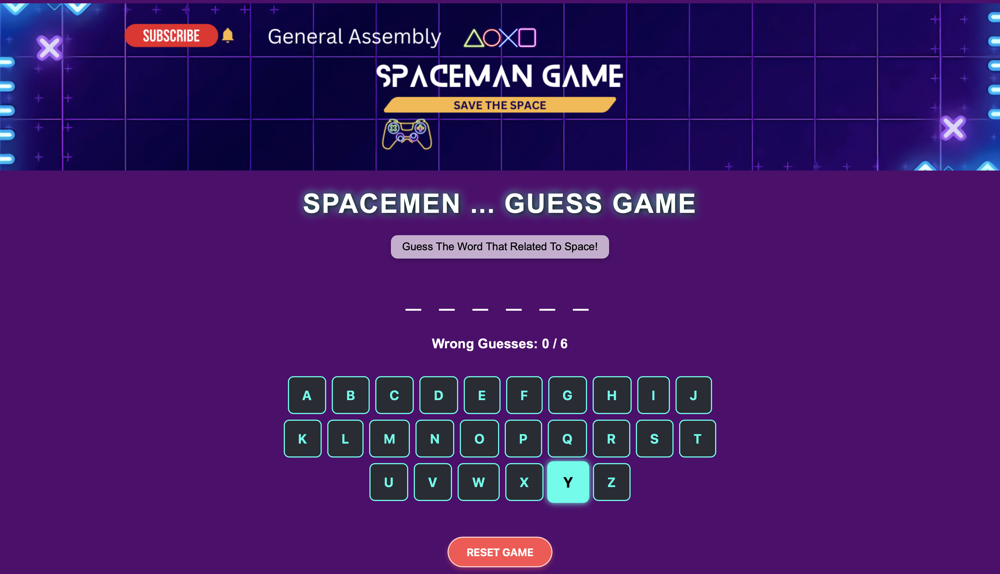

# Spacemen Word Guess Game

Hi! This is a fun word guessing game I made called **Spacemen**. The goal is to guess the word before you run out of tries!


---

## 🎮 How It Works

- The game will choose a random word related to space.
- You need to guess the word by click on the letters.
- If you guess wrong letter, it counts as a mistake. You only get 6 chances!
- If you guess all the letters before hitting 6 wrong guesses, you win!
- There's a **Reset Game** button if you want to play again.

---
🔗 [Live Demo](https://hamadbah.github.io/spaceman-project/)
---

## Files in This Project

Here’s what’s included:

*   css/
    *   style.css
*   images/
    *   ga-banner.png
    *   ScreenShot.png
*   sounds
    *   bad-luck.mp3
    *   winner.mp3
*   app.js
*   index.html
*   README.md


---

## How to Use It

1. Download or clone the project.
2. Open the `index.html` file in your browser.
3. Play the game by clicking on letters to guess!

---

## Methods Used in This Project

- HTML
- CSS
- JavaScript

---

## index.html file

```javascript 
 <!DOCTYPE html> <html lang="en"> 
 <head> <meta charset="UTF-8" /> 
 <meta name="viewport" content="width=device-width, initial-scale=1.0"/> <title>Spacemen Word Guess Game</title> 
 <script src="app.js" defer></script> 
 <link rel="stylesheet" href="./css/style.css" /> 
 </head> <body>  
 <h1>Spacemen ... Guess Game</h1> 
 <p class="intro-text">Guess the word that related to space!</p> 
 <div id="word"></div> 
 <div class="wrong-guesses"> 
 <p>Wrong Guesses: 
 <span id="wrong-count">0</span> / 6</p> 
 </div> 
 <div id="letters"></div> 
 <p id="message"></p> 
 <button id="reset-button">Reset Game</button> 
 </body> 
 </html> 
 ```

## Javascript - Game Logic

## 🛠️ Code Overview

### JavaScript (Game Logic)

_**Guessing Words and Game Variables**_

```javascript
const words = ["planet", "galaxy", "astronaut", "nebula", "satellite"];
let selectedWord = words[Math.floor(Math.random() * words.length)];
let correctGuesses = [];
let wrongGuesses = 0;
const maxWrong = 6;
```
_**Define Sound Efect**_

```javascript
const winnerSound = new Audio('sounds/winner.mp3');
const loserSound = new Audio('sounds/bad-luck.mp3');
```
_**Define DOM Elements**_

```javascript
// DOM Elements
const wordDisplay = document.getElementById("word");
const lettersDiv = document.getElementById("letters");
const wrongCount = document.getElementById("wrong-count");
const message = document.getElementById("message");
document.getElementById("reset-button").addEventListener("click", resetGame);
```
_**Display Alphabet Buttons**_

```javascript
const alphabet = "abcdefghijklmnopqrstuvwxyz";
alphabet.split("").forEach(letter => {
  const btn = document.createElement("button");
  btn.textContent = letter;
  btn.onclick = () => handleGuess(letter, btn);
  lettersDiv.appendChild(btn);
});
```
_**Reset The Game**_

```javascript
function resetGame() {
  selectedWord = words[Math.floor(Math.random() * words.length)];
  correctGuesses = [];
  wrongGuesses = 0;
  wrongCount.textContent = wrongGuesses;
  message.textContent = "";
  winnerSound.pause();
  loserSound.pause();
  document.querySelectorAll("#letters button").forEach(btn => btn.disabled = false);
  updateWordDisplay();
}
```

_**Display Word**_

```javascript
function updateWordDisplay() {
  const display = selectedWord.split("").map(letter =>
    correctGuesses.includes(letter) ? letter : "_"
  ).join(" ");
  wordDisplay.textContent = display;
}
```

_**Handle Guess**_

```javascript
function handleGuess(letter, button) {
  button.disabled = true;
  if (selectedWord.includes(letter)) {
    correctGuesses.push(letter);
    updateWordDisplay();
    checkWin();
  } else {
    wrongGuesses++;
    wrongCount.textContent = wrongGuesses;
    checkLose();
  }
}
```
_**Winning Condition**_

```javascript
function checkWin() {
  const wordComplete = selectedWord.split("").every(letter => correctGuesses.includes(letter));
  if (wordComplete) {
    message.textContent = "Congratulation! You did it.";
    winnerSound.play();
    disableAllButtons();
  }
}
```
_**Losing Condition**_

```javascript
function checkLose() {
  if (wrongGuesses >= maxWrong) {
    message.textContent = `Game Over - You lost! The word was --- ${selectedWord}`;
    loserSound.play();
    disableAllButtons();
  }
}
```

_**Disable Buttons**_

```javascript
function disableAllButtons() {
  document.querySelectorAll("#letters button").forEach(btn => btn.disabled = true);
}
```

_**Start the Game**_

`updateWordDisplay();`

## Style.css

Below is the CSS Code used:

_**Body Styling**_
```css
body {
  font-family: Arial, sans-serif;
  background: rgb(83, 3, 110);
  color: black;
  margin: 0;
  min-height: 100vh;
  display: flex;
  flex-direction: column;
  align-items: center;
  justify-content: center;
  text-align: center;
}
```
_**h1 Styling**_
```css
h1 {
  font-size: 3em;
  color: #fff;
  text-shadow: 2px 2px 10px #000, 0 0 15px #00ffea;
  margin-bottom: 10px;
  letter-spacing: 2px;
  text-transform: uppercase;
}
```
_**Intro Text Class Styling**_
```css
.intro-text {
  font-size: 1.2em;
  color: #000;
  background-color: #ffffffaa; /* Semi-transparent white */
  padding: 10px 20px;
  border-radius: 12px;
  display: inline-block;
  box-shadow: 0 4px 8px rgba(0, 0, 0, 0.2);
  margin-bottom: 20px;
  text-transform: capitalize;
}
```
_**Word Styling**_
```css
#word {
  color: white;
  font-size: 3em;
  letter-spacing: 10px;
  margin: 20px;
  text-transform: uppercase;
}
```
_**Wrong Guess Styling**_
```css
.wrong-guesses {
  display: flex;
  justify-content: center;
  align-items: center;
  font-size: 1.5em;
  color: white;
  font-weight: bolder;
}
```
_**Letters Styling**_
```css
#letters {
  display: flex;
  flex-wrap: wrap;
  justify-content: center;
  gap: 10px;
  margin: 20px auto;
  max-width: 800px;
}
```
_**Letters Button Styling**_
```css
#letters button {
  background-color: #282c34;
  color: #00ffea;
  border: 2px solid #00ffea;
  border-radius: 10px;
  padding: 18px 24px;
  font-size: 1.5em;
  font-weight: bold;
  transition: all 0.2s ease;
  text-transform: uppercase;
}
```
_**Hover Styling**_
```css
#letters button:hover:not(:disabled) {
  background-color: #00ffea;
  color: #000;
  transform: scale(1.1);
  box-shadow: 0 0 10px #00ffea;
}
```
_**Message Styling**_
```css
#message {
  font-size: 1.5em;
  margin-top: 20px;
  color: white;
  text-transform: uppercase;
}
```
_**Reset Button Styling**_
```css
#reset-button {
  padding: 14px 32px;
  font-size: 1.2em;
  font-weight: bold;
  background-color: #ff4d4d;
  color: white;
  border: 2px solid #ffcccc;
  border-radius: 50px;
  cursor: pointer;
  transition: all 0.3s ease;
  text-transform: uppercase;
  box-shadow: 0 4px 8px rgba(255, 77, 77, 0.4);
}
```
_**Reset Button Hover Styling**_
```css
#reset-button:hover {
  background-color: #ff1a1a;
  color: #fff;
  transform: scale(1.5);
  box-shadow: 0 6px 16px rgba(255, 77, 77, 0.6);
}
```

## 📸 Screenshot



> This screenshot is to show how the game looks like.

---

> Hope you enjoy playing it!
